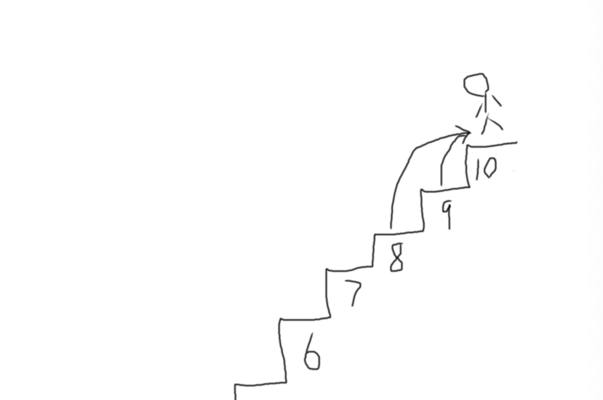
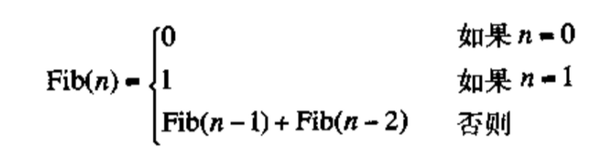
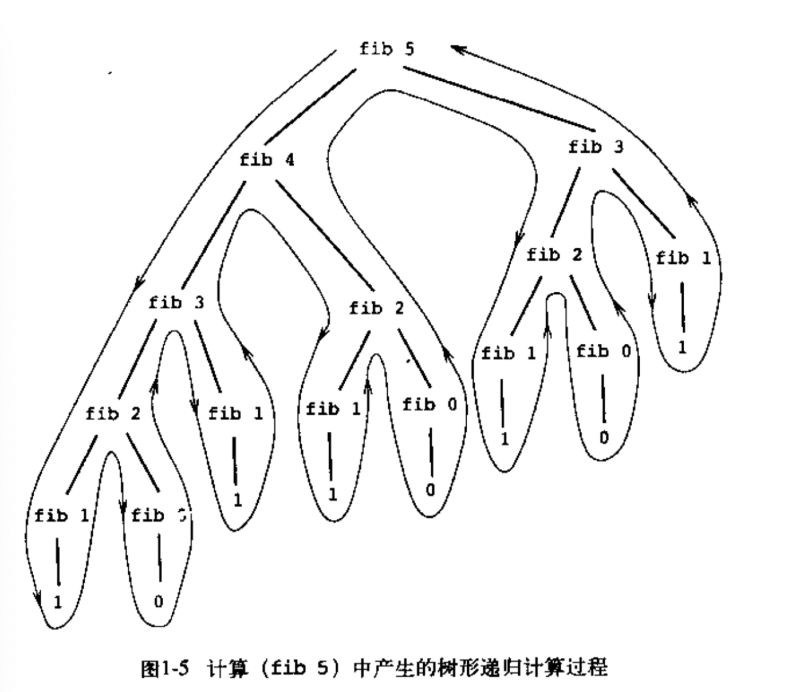
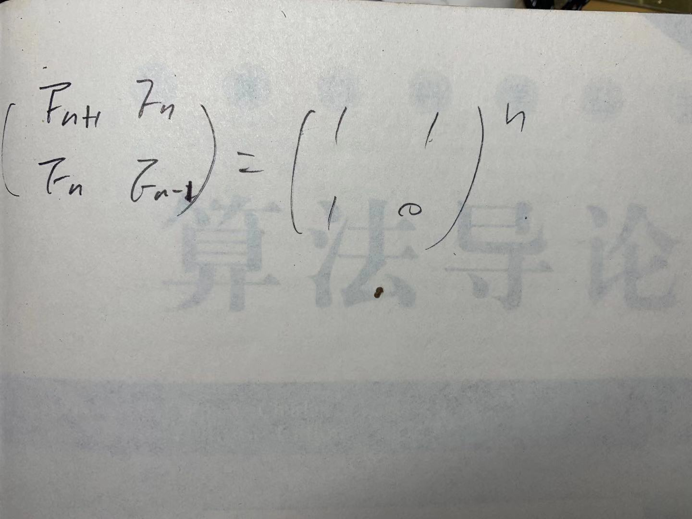
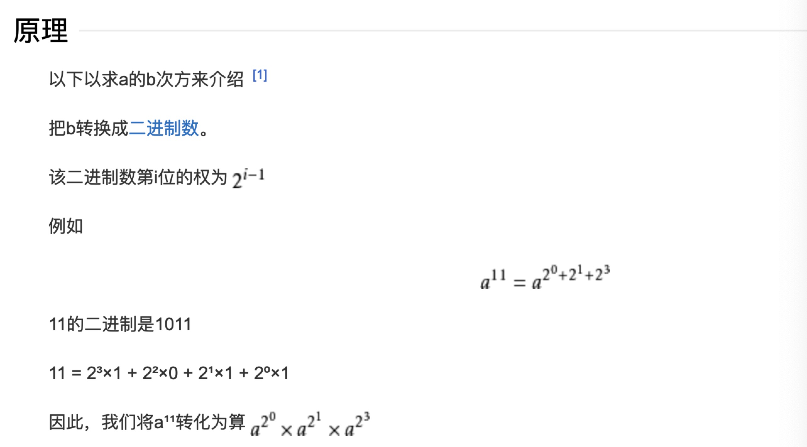
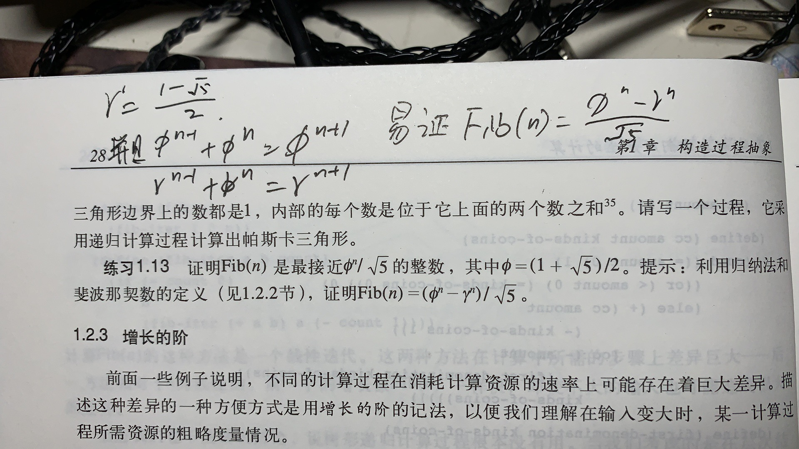

## 说在前面

因为是讲课的剧本，所以有些看似是对话，自己体会吧。。emmm

## 引子

先思考一个问题：

- 现在有一个十个台阶的楼梯，你每次能走一阶或者两阶，请问从底走到顶部，有多少种走法？

一分钟时间思考一下这个问题，如何用代码实现

### 答案

我们换一种思路，我们不从底往上走了，假设你已经站在第10阶了，请问你是怎么到第10阶的呢？



如图，很明显，你只能从第8阶或者第9阶到达第10阶

同理，第9阶是从7，8阶；第8阶是6、7阶。

我们假设f(10)的解是到达第10阶的走法数，则：

f(10) = f(9) + f(8)

同理：f(9) = f(8) + f(7) and so on

啊哈！这不就是斐波那契数列嘛！


- 图片来自《计算机程序的构造和解释》

## 主题

好了，前面说了那么多，终于引入我们的主题了《斐波那契数列的实现》。

这题简单，我会！用递归嘛！10s我就能写好！

- 展示fib_recursion的代码
- 注：我们这里计算的是斐波那契数列的解，如果是台阶的解的话f(n)=fib(n+1)

```go
func fib_recursion(n int) float64 {
	if n <= 1 {
		return float64(n)
	}
	return fib_recursion(n-1) + fib_recursion(n-2)
}
```
- <u>运行一下 完美</u>

### 问题

我们算个稍微大一点点的数看看

- <u>尝试45</u>

哎呀！好慢啊，作为一个精益求精的工程师，这么慢的速度怎么能忍！

看看慢在哪里！看一下函数调用过程，为了方便展示，我们看看计算5的调用过程


- 图片来自《计算机程序的构造和解释》

我的乖乖，每算一个数要分裂两次，而且每一项都需要重复去算，时间复杂度是O(2^n)，所以算个45要这么慢！

那作为一个精益求精的工程师是不是要优化一下！必须的！

我知道你们有些人会Fib的迭代写法，你们超纲了！所以，暂时先忘记这种高级的方式，假设你仅仅只知道递归法。

### 新思路-缓存

你们看，这里调用递归的消耗可以忽略不计，实际上重复计算是消耗最大的。如果我们只算一次，是不是就可以加快计算效率呢。我们尝试一下：
```go
var cache = make([]float64, 2000)
func fib_recursion_cache(n int) float64 {
	if n <= 1 {
		cache[n] = float64(n)
		return float64(n)
	}
	if cache[n] != 0 {
		return cache[n]
	}
	// 这里先计算了f(n-2)，是因为有些语言有最大堆栈限制，先计算n-2可以使深度提高一倍
	// 甚至可以略微提高效率，初步猜测是堆栈深度也会对效率有一定的影响。
	cache[n] = fib_recursion_cache(n-2) + fib_recursion_cache(n-1)
	return cache[n]
}
func fib_cache(n int) float64 {
	cache = make([]float64, 2000)
	return fib_recursion_cache(n)
}
```

我们建了个数组，将每次计算完的数缓存起来，如果数组里有这个数，直接取，如果没有才进行计算。这样瞬间我们从原来计算2^n次，变成了计算n次！其余只需要查表就可以完成(约为O(2^n))。

- <u>我们看看效率如何</u>

刚刚我们算个45费死劲，现在计算1000眼睛没眨完就结束了。简直是从轮椅换成了大货车！

但是，作为一个精益求精的工程师，效率不能仅仅只看时间复杂度，我们还要看空间复杂度

如果忽略查表，只看计算时间复杂度，是O(n)

空间复杂度呢，相比之前的我们多用了一个n大小的数组，也是O(n)，所以才叫"大货车"

emmmm，其实也不是特别大 64*2000/1024=125kbit的内存，对于现在的计算机来说再多几个0也完全oxxk

这里补充一下，可能有些人对如何计算时间空间复杂度不是很懂。可以简单的理解为如果你的输入是n，那么到得出结果，你要进行的步骤(与n相关)就是时间复杂度，消耗的空间(与n相关)就是空间复杂度。这个大家如果感兴趣可以去看《算法导论》，或者Google一下。

好了回到主题，总觉得缓存法差点什么，作为精益求精的工程师！我们来看看有没有效率更高，这里指时空效率更高的算法


### 迭代法

先说点题外话！

To iterate is human,to recurse divine.

翻译过来：迭代是人，递归是神。

这个世界被设计成递归的方式，从夸克到原子、分子、地球、恒星直至宇宙，递归无处不在。可能作为凡人的我们可能无法理解神的思路，那么我们用人的方式理解一下。

绝大多数的递归函数，都可以用迭代法实现。至于如何把递归转成迭代的方式，我不详述了，感兴趣可以去看《算法导论》以及《计算机程序的构造和解释》。

好了我们回归主题，斐波那契也不例外，也可以写成迭代法。

刚爬楼梯的时候我们是自顶向下分析的出的解决方案，并且得到了前两种算法。现在不妨我们再转换一个思路，这次自底向上分析。如图：


我们已知了f(0)和f(1)，易知f(2)

同理可知f(3)、f(4)....

到这就很简单了，我们看代码：
```go
func fib_iterate(n int) float64 {
	a, b := 1.0, 0.0
	for ; n > 1; n-- {
		a, b = a+b, a // => t=a;a=a+b;b=t
	}
	return a
}
```

看看这代码多么优美，多么精炼！体现了人类的数学之美！

因为只有一个for循环，所以时间复杂度是O(n)，而空间复杂度呢？仅仅只用了a,b两个数字！空间复杂度从O(n)变成了O(1)！简直提升了一个马里亚纳海沟。

- <u>运行一下</u> 

真快！大货车摇身一变，成了超跑！

都是O(n)啊，为啥是变超跑，最后所有的解决方案都说完了，我们再进行比较

哎，等等，为啥是所有解决的方案，难道这3个算法还不能令你满意吗？

当然不能，作为一个精益求精的工程师。在吃饱了饭以后就应该去思考如何优化他写的代码！

## 质变

我的《算法导论》的第一页上写了这么一个公式：



我忘了我从哪看到的这个公式，应该是刚毕业的时候看《算法导论》的时候写到上面的

这个需要一点点线性代数的知识，我在黑板上算一下

- <u>黑板上写公式，算两下</u>

好了，这个公式的原理大家理论上都理解了。但是这也没有提升计算效率啊，n次方不是还要乘n次嘛！而且之前只算a+b，现在你要算矩阵乘法，计算量多了好多倍。

你这个所谓的精益求精工程师怕不是是塑料的。

好吧，我既然敢把这个公式列出来，那山人自有妙计，看我的大杀器！

提一句，能用大杀器，是因为矩阵乘法满足结合律。

好了，我们看看大杀器。

### 大杀器

我们在计算次幂的时候，其实是有一个贼牛逼的方法，叫做快速幂，

我们看一下原理


- 图片来自《百度百科:快速幂》

- <u>黑板上演算一下</u>

Talk is cheap, show me the code 

看起来比较抽象，直接看代码吧。
```go
func fast_pow_mat22(x *mat22, n int) *mat22 {
	I := &mat22{1, 0, 0, 1}
	for n > 0 {
		if n&1 == 1 {
			I = I.mul(x)
		}
		x = x.mul(x)
		n >>= 1
	}
	return I
}
```

全部代码我就不放了，看看快速幂是怎么实现的吧

- <u>看看运行结果</u>

简直快！我们突然从超跑变成了飞机

能飞了！脚离地了，聪明的智商就占领了高地了。

时间复杂度从O(n)，变成了O(log(n))

但是作为精益求精的工程师，我们看一下2*2矩阵乘法的实现
```go
type mat22 struct {
	a float64 // 0 0
	b float64 // 0 1
	c float64 // 1 0
	d float64 // 1 1
}
func (a *mat22) mul(b *mat22) *mat22 {
	//a[0][0] * b[0][0] + a[0][1] * b[1][0];
	//a[0][0] * b[0][1] + a[0][1] * b[1][1];
	//a[1][0] * b[0][0] + a[1][1] * b[1][0];
	//a[1][0] * b[0][1] + a[1][1] * b[1][1];
	return &mat22{
		a.a*b.a + a.b*b.c,
		a.a*b.b + a.b*b.d,
		a.c*b.a + a.d*b.c,
		a.c*b.b + a.d*b.d,
	}
}
```

明明我们只需要算一个数，却额外计算了这么多次。作为精益求精的工程师能忍吗？不能忍！

但是好在，精益求精的工程师吃饱了饭偶尔看看书，"无意"间看到了一个证明题，刚才的快速幂是大杀器，这个就算是小杀器吧！

### 小杀器



如图，下面的练习1.13就是我所说的证明题，解题过程就在上面。精髓在”易证“两字上，至于我为啥不把证明过程写全，其实和费马不证明费马大定律的证明是一个原因：

#### 纸不够了。

真嘚瑟，还是看看代码吧
```go
import "math"
var sqrt5 = math.Pow(5, 0.5)
func fast_pow_float64(x float64, n int) float64 {
	r := 1.0
	for n > 0 {
		if n&1 == 1 {
			r *= x
		}
		x *= x
		n >>= 1
	}
	return r
}
func fib_formula(n int) float64 {
	a := (1 + sqrt5) / 2
	b := (1 - sqrt5) / 2
	return (fast_pow_float64(a, n) - fast_pow_float64(b, n)) / sqrt5
}
func fib_formula_builtin(n int) float64 {
	a := (1 + sqrt5) / 2
	b := (1 - sqrt5) / 2
	return (math.Pow(a, float64(n)) - math.Pow(b, float64(n))) / sqrt5
}
```

因为也是计算n次方我们还是用了快速幂算法。但是细心的同学会发现，我还写了一个builtin的方式来对比

终于，所有的算法都列全了，让我们来对比一下效率吧，这里我用了go语言提供的压测工具gobench：

| 算法名 | n=10000的时间 | n=1000的时间 | 
| ----- | ----- | -----|
| BenchmarkFibRecursion-12 | 50575171 ns/op | 50458202 ns/op |
| BenchmarkFibCache-12 | 79281 ns/op | 13732 ns/op |
| BenchmarkFibIterate-12 | 15832 ns/op | 1527 ns/op |
| BenchmarkFibMatrix-12 | 411 ns/op | 341 ns/op |
| BenchmarkFibFormulaBuiltIn-12 | 72.6 ns/op | 70.7 ns/op |
| BenchmarkFibFormula-12 | 22.7 ns/op | 18.1 ns/op |

- 注：递归法计算的是35
- 注：计算10000其实超出了float64的上限，可能时间会不准确

可以看到这俩，一个快成了J20，一个快成了长征5

## 比较

- 递归法就不说了，O(2^n)没得洗，弟中弟
- 缓存法O(n)的计算+O(2^n)的查表，但是多了O(n)的空间复杂度
- 迭代法O(n)，程序员友好，易于实现，mvp，全场最佳
- 矩阵法O(log(n))，快，需要数学知识，但在能飞的里面是弟中弟
- builtin公式法O(log(n))，不是最快，因为看了math.Pow的实现会发现里面有大量的别的逻辑
  - 这个故事告诉我们不要盲目相信系统提供的就是最好的，看实现源码，具体问题具体分析
- 公式法O(log(n))，吃鸡算法，强，无敌。但是还是有点点小瑕疵。

### 瑕疵

看看这几个算法计算10和1000时的答案，我没有那个命等递归法算1000，所以踢出了队伍。

| 算法名 | n=10 | n=1000 |
| ----- | ----- | ----- |
| TestFibRecursion | 55 | NaN |
| TestFibCache | 55 | 7.0330367711422765e+208 |
| TestFibIterate | 55 | 7.0330367711422765e+208 |
| TestFibMatrix | 55 | 7.033036771142278e+208 |
| TestFibFormulaBuiltIn | 54.99999999999999 | 7.033036771142261e+208 |
| TestFibFormula | 54.99999999999999 | 7.033036771142261e+208 |


首先，因为使用的float64，所以所有计算1000时都会有精度损失。

其次，两个公式法因为还有加减操作，所以精度损失更大，这个就是小瑕疵。

最后，如果各位感兴趣，可以自己实现一下如何做超大整数的计算。

## 总结

好了听我BB了这么久。

肯定也听烦了，心里一定想这人竟然在这里装逼装了这么久，疯狂炫技，令人发指！

所以，我们究竟讲了什么呢？难道真的是炫技这么简单吗？

其实不是的，下面说说我究竟想要传达什么

### 技术上的

##### 1. “引子”里提到的答案

这里用到的思想，其实是动态规划，具有以下特性：

- 最优子结构
- 边界
- 状态转移公式

简单讲就是把一个辅助问题分阶段进行简化，逐步简化成简单的问题，这个就是动态规划的思想。

- f(10)、f(9)、f(8)就是“最优子结构”
- f(1)、f(2)、a、b就是“边界”
- f(n)=f(n-1)+f(n-2)、a,b=a+b,a就是“状态转移公式”

大家理解理解

##### 2. 要 "懒"一些

这里的懒不是说，不去做，而是想好了再做。毕竟在旁人看来，思考是没有所谓的"产出"的

就像第一个递归法一样，不加思考直接上手编程，看似10s写完代码，却要用"一生"去debug

这一点也有理论基础，大家感兴趣可以去看《编程珠玑》及《高效能人的七个习惯》，里面对先思考再做事儿，都有比较透彻的见解。

这是你变成精益求精的工程师的必要原则

##### 3. 算法的时空模型

这个偷了个懒没有详细讲清楚，主要是因为书里讲得太好了

理解了如何计算时空复杂度，会对你如何写优秀的代码有很大的帮助

而且节约生命，如果你用递归法去算fib(1000)，那只能等你不知道多少代的孙子把结果烧给你了。

但是，时间复杂度低，用的时间就少吗？其实也不是的。

- 我们看看计算10时候的各个算法效率

| 算法名 | n=10的时间 |
| ----- | ----- |
| BenchmarkFibRecursion-12 | 329 ns/op |
| BenchmarkFibCache-12 | 1371 ns/op |
| BenchmarkFibIterate-12 | 4.92 ns/op |
| BenchmarkFibMatrix-12 | 138 ns/op |
| BenchmarkFibFormulaBuiltIn-12 | 55.6 ns/op |
| BenchmarkFibFormula-12 | 10.0 ns/op |

咦，迭代法竟然是最快的！为啥呢？

因为每一步计算的常数c不一样。这点告诉我们，我们采用算法时要多方考虑，算法效率，数据规模都是我们要关注的点

大家感兴趣可以看看很多语言的sort的实现，一般都是快排+插入排序的实现。快排的分治思想提供了对大规模数据O(log(n))的快速计算，而插入排序提供了对小规模数据更小的常数c的O(n)的计算

##### 4. 过早的优化是万恶之源

这点我之前没有说，但是现在不得不提了，害怕你们误入歧途。

优化代码，首先你之前的代码已经取得了正确的结果。但是你对算法的时空复杂度极度不满意，而且工期充足。

就用计算斐波那契数列来说，我从递归法到迭代法可能只用了一个晚上，初中时候老师讲得。

但是从迭代法到最后一个公式法，用了整整十几年。看了很多书，知道了很多可行的计算方式才优化出来的。

如果我连迭代法的正确性都无法保证的话，后面的东西也都是扯淡！

所以优化代码，先优化自己。

##### 5. 优化代码的套路

这里必须再强调一遍上条“过早的优化是万恶之源”。
```
套路千万条，正确第一条
疯狂追效率，运行两行泪
```

优化的套路，确实很多很多。我们就说说这几个算法用到的吧。

- 每次计算数据 -> 缓存计算结果
- 递归 -> 迭代
- 巧用数学技巧（炫技警告）
- 别迷信系统库(builtin)，具体问题具体分析

这些都是效率上的优化，还有很多结构上的，架构上的。

优化是工程师绕不开的话题，安全行车，巧用套路。

Last, use it well

### 哲学思考

说完技术上的，既然大家都是汉子，我们来聊聊哲学吧


- 图片来自网络

两千年前，苏格拉底提出了：“无知之知”。怎么理解呢？

“知道自己不知道”

现有的知识，大致分为以下三类：

- 已知的已知
- 已知的未知
- 未知的未知

# todo